# AOD

  
  
  

The main objective of this repository is to organize the results obtained by the Anomaly and Outlier Detection (AOD) method that works on time series data. 

The [Instances](./Instances/) directory stores the instance files in csv that were generated and used in the experiments. The published files are about multivariate time series. The instances of YOB (Yahoo Outlier Benchmark) and NAB (Numenta Anomaly Benchmark) are not disclosed here, but can be obtained from the links [YOB](https://webscope.sandbox.yahoo.com/catalog.php?datatype=s\&did=70) and [NAB](https://github.com/numenta/NAB). The instance of the case study was not disclosed due to industrial property issues.

The [Results](./Results/) directory stores the results obtained by the AOD method. This directory has the following subdirectories: 1-YOB, 2-NAB, 3-Synthetic-Dataset and 4-Case-Study. See the directory structure shown below.

  
Show directory structure

  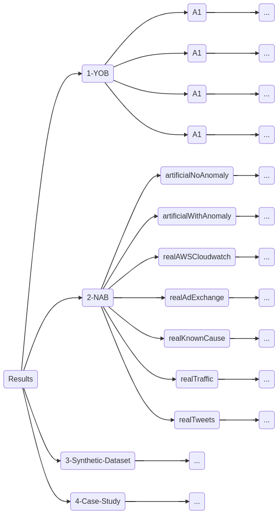

### Results YOB

The [1-YOB](./Results/1-YOB/) directory has four subdirectories which are: A1, A2, A3 and A4. Inside each of these directories we have the images showing the results of the experiments on the YOB benchmark. The images give a photographic idea that shows how the method works. Some of the images from the experiments are shown below.

| Results - YOB                                     | Results - YOB                                     |
|:-------------------------------------------------:|:-------------------------------------------------:|
| 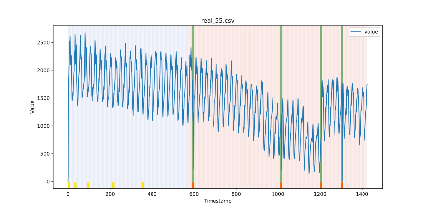          |      |
| A1 Benchmark - Instance 55                        | A2 Benchmark - Instance 38                        |
|  |  |
| A3 Benchmark - Instance 39                        | A4 Benchmark - Instance 35                        |

### Results NAB

The [2-NAB](./Results/2-NAB/) directory has seven subdirectories which are: artificialNoAnomaly, artificialWithAnomaly, realAdExchange, realAWSCloudwatch, realKnownCause, realTraffic and realTweets. Inside each one of these directories we have the images showing the results of the experiments on the NAB benchmark. Some of the images from the experiments are shown below.

| Results - NAB                                             | Results - NAB                                                   |
|:---------------------------------------------------------:|:---------------------------------------------------------------:|
| 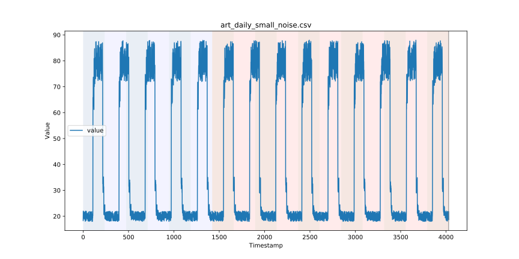 | 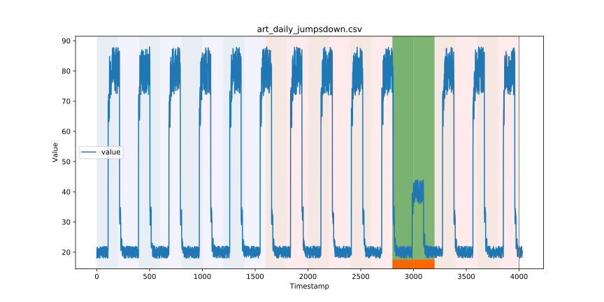 |
| artificialNoAnomaly - art_daily_small_noise               | artificialWithAnomaly - art_daily_jumpsdown                     |
| 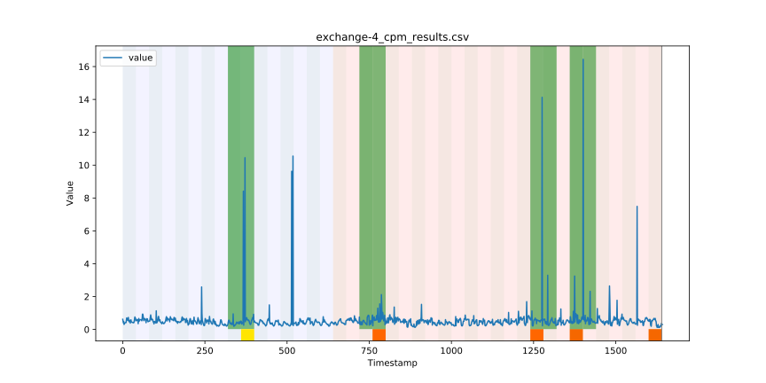 | 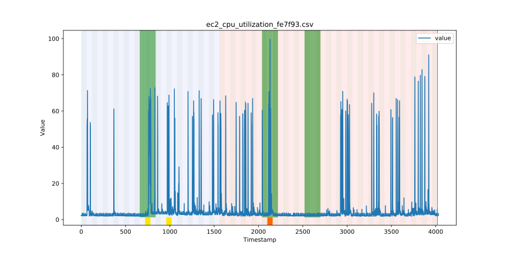 |
| realAdExchange - exchange-4_cpm_results                   | realAWSCloudwatch - ec2_cpu_utilization_fe7f93                  |
| 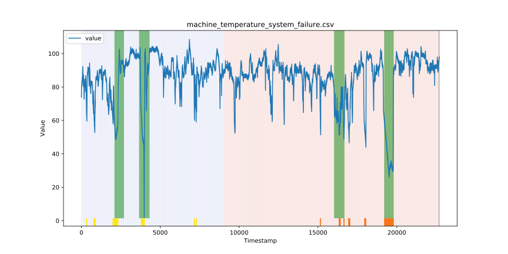  | 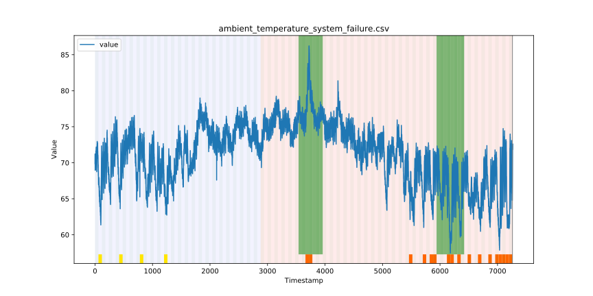  |
| realKnownCause - machine_temperature_system_failure       | realKnownCause - ambient_temperature_system_failure             |
| 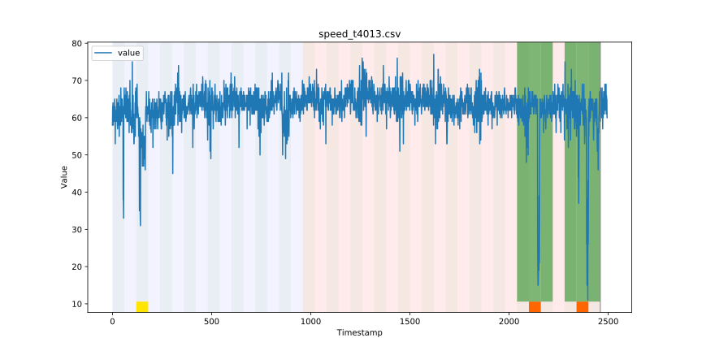     | 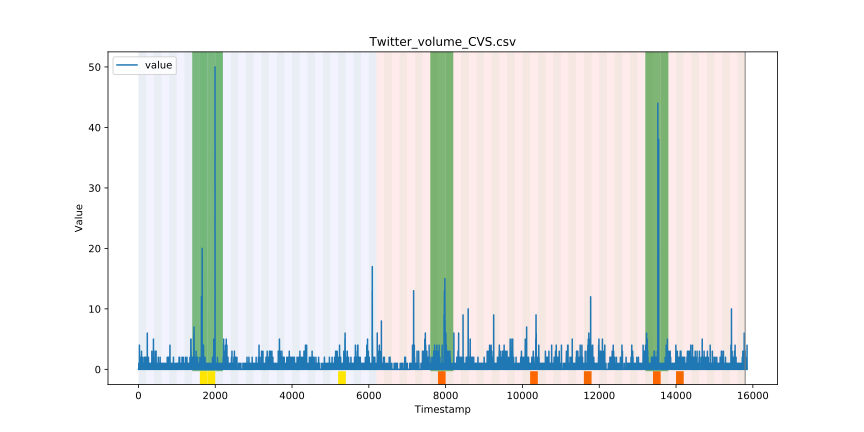     |
| realTraffic - speed_t4013                                 | realTweets - Twitter_volume_CVS                                 |

### Results Synthetic Dataset

The [3-Synthetic-Dataset](./Results/3-Synthetic-Dataset/) directory has five files in which these files contain the images showing the results of experiments on synthetic data generated using the [agots](https://github.com/KDD-OpenSource/agots) tool. Some of the images from the experiments are shown below. 

| Results - Synthetic Dataset                                | Results - Synthetic Dataset                                |
|:----------------------------------------------------------:|:----------------------------------------------------------:|
| 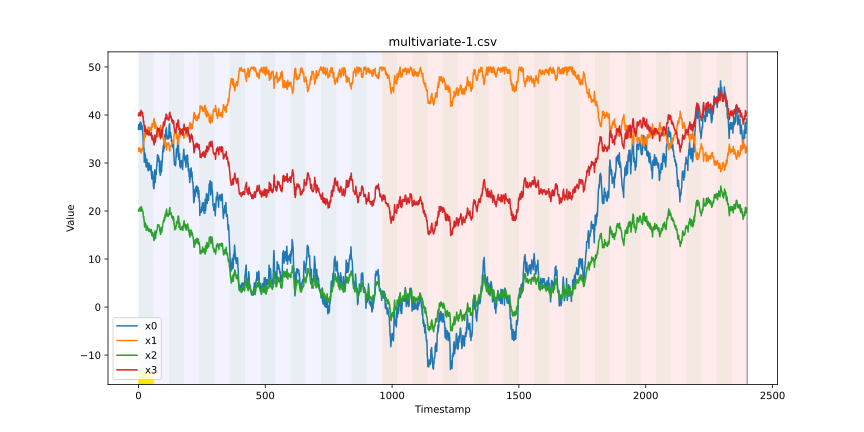 | 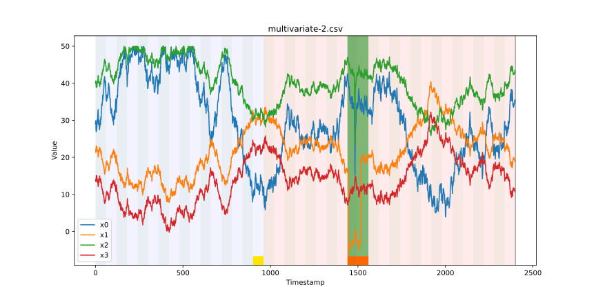 |
| Synthetic Dataset Multivariate - Instance 1                | Synthetic Dataset Multivariate - Instance 2                |
| 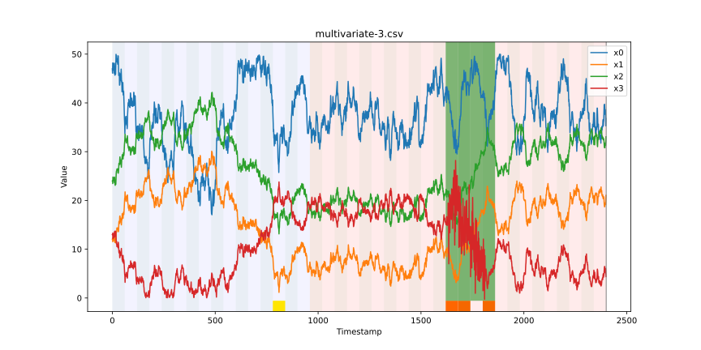 | 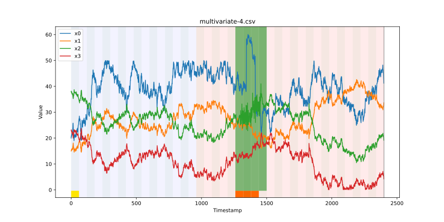 |
| Synthetic Dataset Multivariate - Instance 3                | Synthetic Dataset Multivariate - Instance 4                |
| 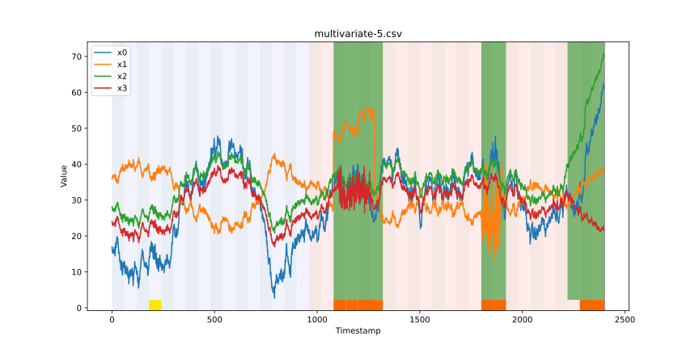 |                                                            |
| Synthetic Dataset Multivariate - Instance 5                |                                                            |

### Results Case Study

The [4-Case-Study](./Results/4-Case-Study/) directory has a file containing an image showing the result of one of the experiments performed on the case study with multivariate data. An example image of one of the experiments is shown below. 

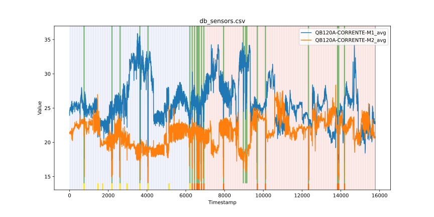
