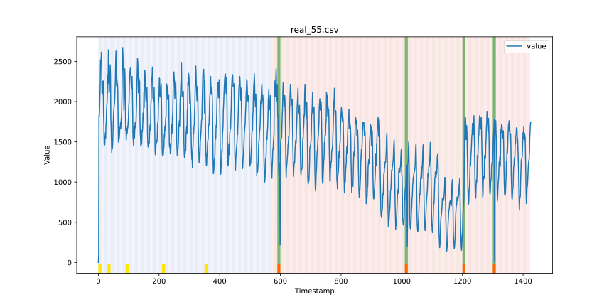
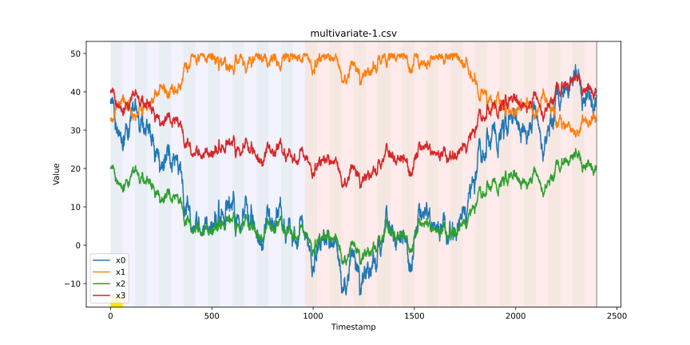
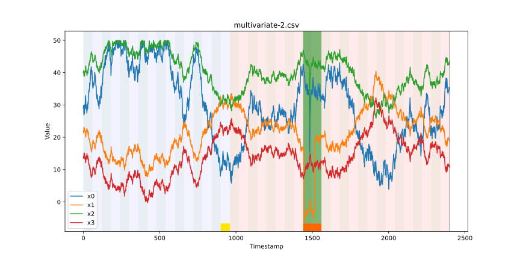
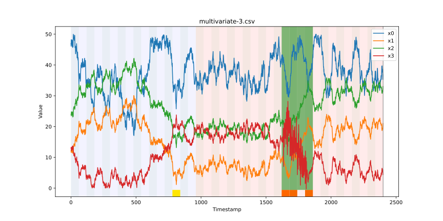
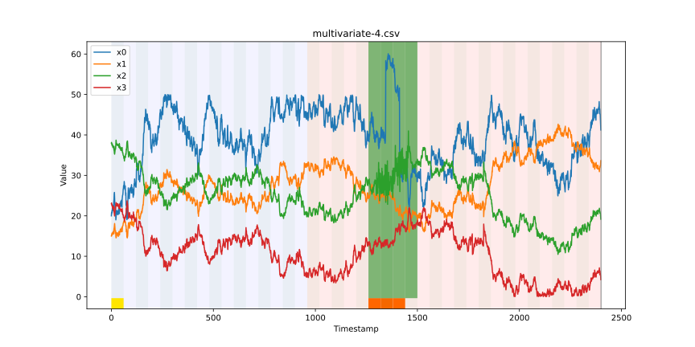
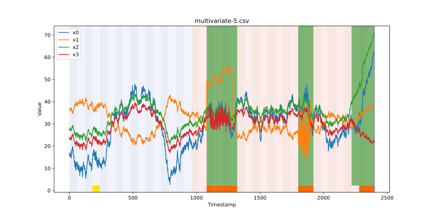

# AOD

  
  
  

O principal objetivo deste repositório é fazer a organização dos resultados obtidos pelo método de Anomaly and Outlier Detection (AOD) que funciona sobre dados de séries temporais. 

O diretório [[Instances](./Instances/)] armazena os arquivos de instância em csv que foram gerados e utilizados nos experimentos. Os arquivos divulgados são sobre séries temporais multivariadas. As instâncias do YOB (Yahoo Outlier Benchmark) e NAB (Numenta Anomaly Benchmark) não estão aqui divulgados, mas podem ser obtidos nos links [[YOB](https://webscope.sandbox.yahoo.com/catalog.php?datatype=s\&did=70)] [[NAB](https://github.com/numenta/NAB)].

O diretório [[Results](./Results/)] armazena os resultados obtidos pelo método AOD. Este diretório possui os seguintes sub-diretórios: 1-YOB, 2-NAB, 3-Synthetic-Dataset e 4-Case-Study. 

## Results YOB

O diretório [[1-YOB](./Results/1-YOB/)] possui quatro sub-diretórios que são: A1, A2, A3 e A4. Dentro de cada uma desses diretórios temos as imagens mostrando os resultados dos experimentos. As imagens dão uma ideia fotográfica que mostram o funcinoamento do método. Algumas das imagens dos experimentos são mostradas a seguir. 

| Results - YOB                                          | Results - YOB                                          |
|:------------------------------------------------------:|:------------------------------------------------------:|
|            |       |
| A1 Benchmark - Instance 55                             | A2 Benchmark - Instance 38                             |
|   |   |
| A3 Benchmark - Instance 39                             | A4 Benchmark - Instance 35                             |

## Results NAB

O diretório [[2-NAB](./Results/2-NAB/)] possui sete sub-diretórios que são: artificialNoAnomaly, artificialWithAnomaly, realAdExchange, realAWSCloudwatch, realKnownCause, realTraffic e realTweets. Dentro de cada uma desses diretórios temos as imagens mostrando os resultados dos experimentos. Algumas das imagens dos experimentos são mostradas a seguir. 

| Results - NAB                                          | Results - NAB                                          |
|:------------------------------------------------------:|:------------------------------------------------------:|
|            |       |
| artificialNoAnomaly - art_daily_small_noise            | artificialWithAnomaly - art_daily_jumpsdown            |
|   |   |
| realAdExchange - exchange-4_cpm_results                | realAWSCloudwatch - ec2_cpu_utilization_fe7f93         |
|   |   |
| realKnownCause - machine_temperature_system_failure    | realKnownCause - ambient_temperature_system_failure    |
|   |   |
| realTraffic - speed_t4013                              | realTweets - Twitter_volume_CVS                        |

## Results Synthetic Dataset

O diretório [[3-Synthetic-Dataset](./Results/3-Synthetic-Dataset/)] possui cinco arquivos em que esses arquivos revelam as imagens mostrando os resultados dos experimentos sobre dados sintéticos gerados utilizando a ferramenta . Algumas das imagens dos experimentos são mostradas a seguir. 

| Results - Synthetic Dataset                                    | Results - Synthetic Dataset                                    |
|:--------------------------------------------------------------:|:--------------------------------------------------------------:|
|  |  |
| Synthetic Dataset Multivariate - Instance 1                    | Synthetic Dataset Multivariate - Instance 2                    |
|  |  |
| Synthetic Dataset Multivariate - Instance 3                    | Synthetic Dataset Multivariate - Instance 4                    |
|  |                                                         |
| Synthetic Dataset Multivariate - Instance 5                    |                                                                |

## Results Case Study

O diretório [[4-Case-Study](./Results/4-Case-Study/)] possui um arquivo contendo uma imagem mostrando o resultado de um dos experimento realizados sobre o estudo de caso com dados multivariados. Um exemplo de imagem de um dos experimentos é mostrado a seguir. 

