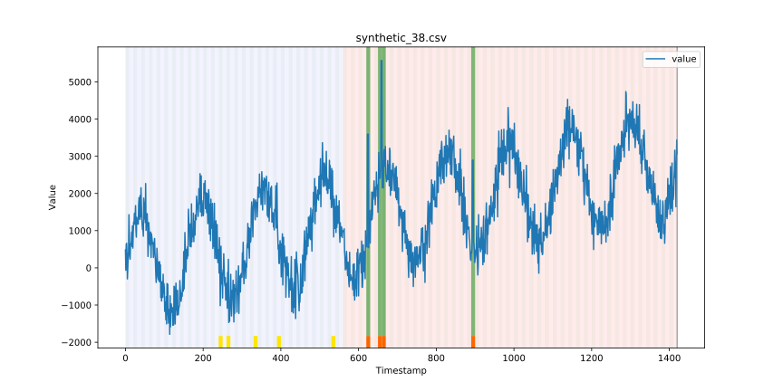
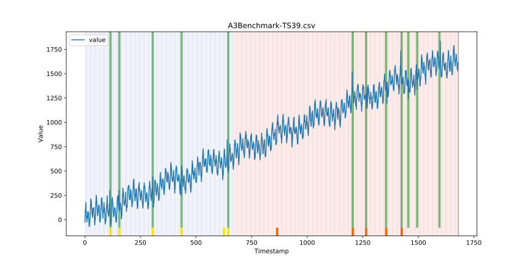
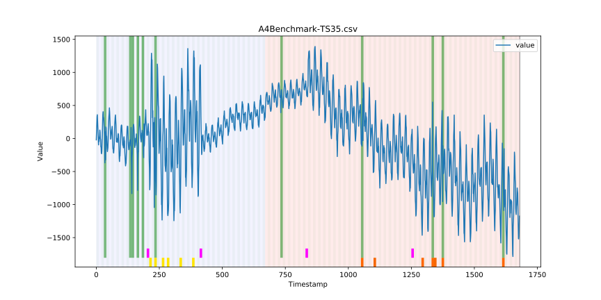
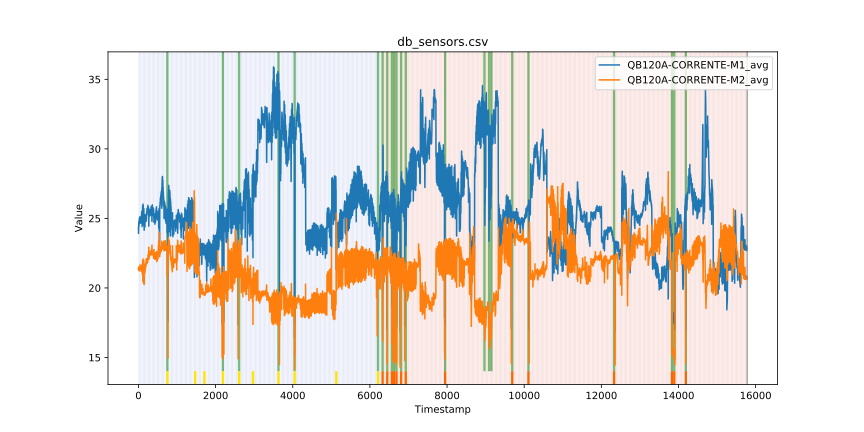

# AD3C

  
  
  

Repositório com os resultados do método AD3C. 

Na pasta [[YOB](./YOB/)] temos os resultados do método AD3C aplicado sobre o benchmark do Yahoo Outlier Benchmark. A pasta YOB possui quatro subpastas que são: A1, A2, A3 e A4. Dentro de cada uma dessas pastas, existem ainda três subpastas, que são: analysis-training-fraction, analysis-window-size e analysis-cut-factor. Dentro de cada uma dessas pastas existem ainda mais subpastas com nomes que revelam os valores dos parâmetros utilizados nos experimentos de análise de sensibilidade. Por fim, dentro de cada pasta temos imagens com os resultados dos experimentos. 

| Results                                                                 |
|-----------------------------------|-------------------------------------|
|   |   |
| A1 Benchmark - Instance 55 | A2 Benchmark - Instance 38 |
|   |   |
| A3 Benchmark - Instance 39 | A4 Benchmark - Instance 35 |

Na pasta [[NAB](./NAB/)] temos os resultados do método AD3C aplicado sobre o benchmark do Numenta Anomaly Benchmark.

Na pasta [[Casy-Study](./Casy-Study/)] temos os resultados do método AD3C aplicado sobre um estudo de caso real.

